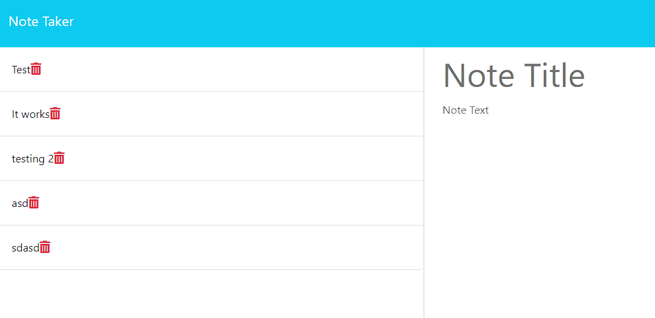

# 11 Express.JS Note Taker

# Table of Contents

- [Description](#description)
- [Process](#installation)
- [Usage](#usage)
- [License](#license)
- [Tests](#tests)
- [Contributors](#contributors)
- [Questions](#questions)

## Description

This project had supplied front end files, and tasked me to complete the back end development to create a program for users to take notes.

## Installation

Users will need to have Express and Node.js to use this application properly

## Usage

User will need to enter the command "Node Server.js" to start the program

## Licenses

    This project is covered under the MIT license. To learn more about what this means, click the license button at the top.

## Tests

This project was tested via running the script and ensuring that all pathways worked properly

## Contributors

This project is not currently open to new contributors

## Questions

Have questions about this project?  
 GitHub: https://github.com/AnthonyKahly  
 Email: Akahly@gmail.com
